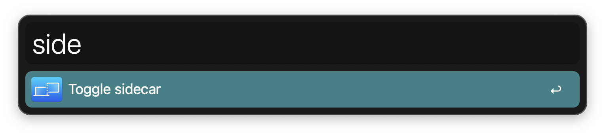

# apple-hide-my-email-shortcut-alfred

## What is it?

Simple Apple shortcut as well as alfred workflow for toggling a sidecar i.e. iPad as a second display. This is useful for people who use their iPad as a second display and want to quickly toggle it on and off.

## Install the shortcut

1. Clone the repository
2. Install the apple shortcut from `shortcut` directory
3. Install the alfred workflow from `alfred` directory
4. Make sure to allow any missing accessibility privileges

## Compatibility

### Tested

- macOS Ventura 13.4.1
- alfred 5.1.1

## Attribution

The Apple Script that powers the shortcut's functionality was inspired by reddit post [Ventura AppleScript toggle for Sidecar](https://www.reddit.com/r/applescript/comments/ylsv37/ventura_applescript_toggle_for_sidecar) by [u/itcouldvebeensogood](https://www.reddit.com/user/itcouldvebeensogood/)

## Disclaimer

The Apple script uses macOS GUI elements and Apple may introduce breaking changes with newer updates. I will try to keep this up to date with newer macOS versions, but will not be my top priority.

## Screenshots

